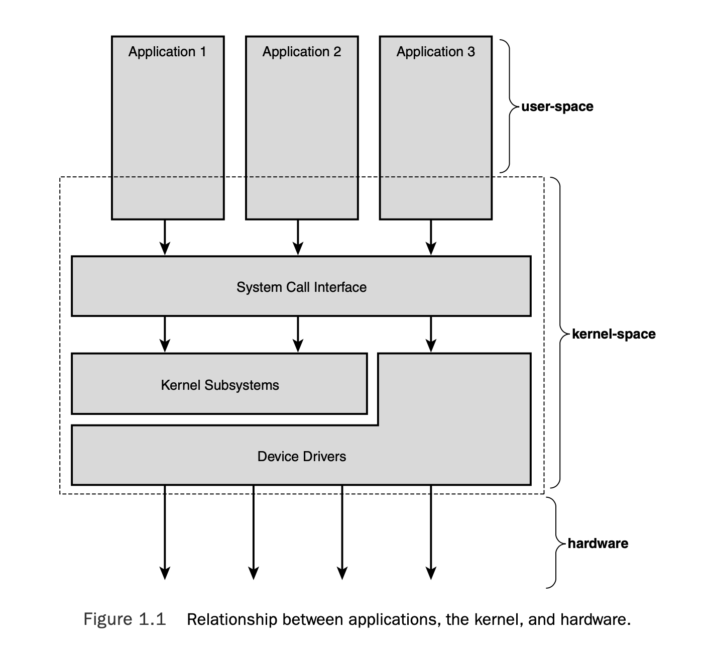

# 操作系统和内核概览

随着现代商业操作系统中的功能越来越多，并且很多设计并不合理，我们无法很准确的定义什么是一个操作系统。 很多人认为，他们在屏幕上看到的就是一个操作系统。但是准确来讲，在本书中， `操作系统`只是用来管理硬件和提供基本交互的一个组件，这个组件包含了内核、设备驱动、引导加载程序、命令行shell以及基本的文件和系统组件。 你需要的那些组件，比如网页浏览器和音乐播放器，并不属于操作系统的一部分，而是运行在操作系统上的软件而已。

当然，本书的主题是内核。 用户接口属于操作系统的外围组件，而内核是操作系统的内部组件。 它是系统内部的核心，提供了系统中的一些基础服务、管理硬件和分配资源。内核会被认为是管理员、核心或是操作系统内部。 比较有代表性的内核组件有中断处理程序来处理中断请求；调度程序来为不同进程分配处理器时间；内存管理程序用来管理进程地址空间；还有一些网络和进程间通信的系统服务。 现在操作系统中都有受到保护的内存管理单元，与一般用户应用相比，内核一般存在在更高级别的系统状态中。这个区域是一个受保护的内存区域而且可以直接访问硬件设备，我们统称这个区域为`内核空间`。相反的，用户程序运行在`用户空间`，用户程序可以看到物理机的一部分可用资源，并且执行特定的系统函数，直接访问硬件，访问内核分配给它们以外的内存空间，以及其他异常行为。 当执行内核代码时，系统在内核空间以内核模式执行代码。 当运行一个普通程序时， 系统在用户空间以用户模式执行代码。

系统中运行的应用通过`系统调用`来和内核进行通信（如图1.1）。 应用程序一般会调用库中的函数（比如C动态链接库），C语言的动态链接库依赖系统调用的接口来指示内核完成应用程序的需求。 一些动态链接库的调用提供了很多系统调用中没有的功能，所以，我们只需要调用一个大的函数就可以进入内核空间。 例如，我们最常见到的函数printf()。 它提供了数据格式化和缓存功能，还调用了write()来把数据输出到控制台上。 相反地， 一些动态链接库调用与内核有一对一的关系。例如，open()库函数与系统调用的open()就很类似。 其他库函数，比如strcpy(), 则不应该直接使用内核。 当应用程序执行一个系统调用时，我们称其为`内核代表应用程序在执行任务`，对于应用，我们会说`应用程序在内核空间执行系统调用`，内核正在运行`进程上下文`。 应用程序可以通过系统调用接口访问内核，才能使程序完成我们想要其执行的任务。

内核还负责管理系统硬件。 几乎所有的硬件架构以及Linux所支持的所有操作系统，都提供了名为`中断`的概念。 当硬件想要与系统交互时，它会发出一个中断真的中断处理器当前的操作，进而中断内核的操作。 每个中断在内核中都用数字来代表，内核利用这些数字执行特定的中断处理程序来处理和响应中断。比如，当你用键盘进行输入时，键盘控制器发送中断让系统知道键盘的缓冲区中有新的数据存在。 内核本身知道这个中断对应的中断号码，然后对应号码找到正确的中断处理程序，并进行执行。中断处理程序处理了键盘缓冲区的数据，然后再让键盘控制器知道它可以再接受新的数据了。 为了提供同步性，内核可以禁用所有中断，或者某一个中断。 包括Linux在内的很多操作系统中，中断处理程序不会在任何进程上下文中运行，他们一般会运行在`中断上下文`中，和任何进程都没有联系。这种特殊的上下文保证中断处理程序可以快速响应一个中断，然后退出。

这些上下文展现出了内核活动的广度。 实际上， Linux中， 我们可以把每个处理器要做的事情概况如下：
+ 用户空间中， 一个程序执行用户代码
+ 内核空间中，并且处于进程上下文里，为一个用户态进程执行它所需的内核代码
+ 内核空间中，处于中断上下文里，与任何进程都没有关系，处理器在处理一个中断

上述列表比较笼统，但是可以覆盖大部分事件。例如， 当系统处于空闲状态时， 内核会在内核空间中执行一个`空闲进程`。

[上一页](introduction-to-linux.md) [下一页](linux-vs-unix.md) [目录](../README.md)