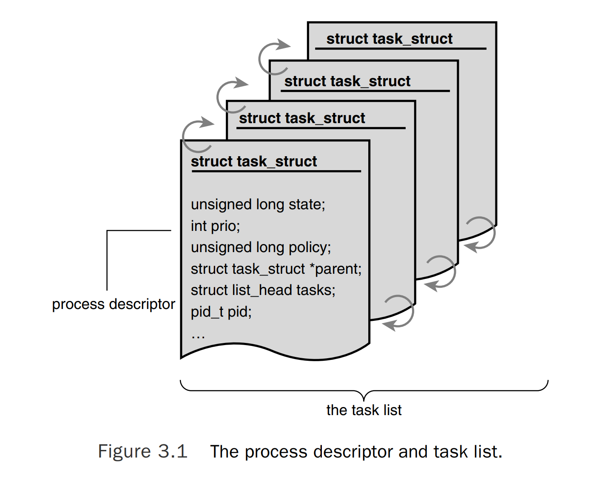
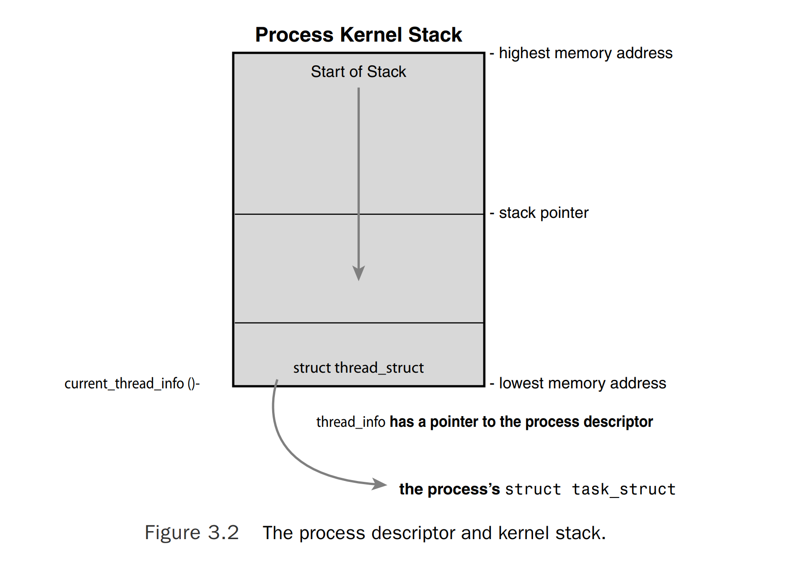

# Process Descriptor and the Task Structure
The kernel stores the list of processes in a circular doubly linked list called the task list. Each element in the task list is a `process descriptor` of the type `struct task_struct`, which is defined in `<linux/sched.h>`. The process descriptor contains all the information about a specific process.

The `task_struct` is a relatively large data structure, at around 1.7 kilobytes on a 32-bit machine. This size, however, is quite small considering that the structure contains all the information that the kernel has and needs about a process. The process descriptor contains the data that describes the executing program --- open files, the process's address space, pending signals, the process's state, and much more (see Figure 3.1).



## Allocating the Process Descriptor
The `task_struct` structure is allocated via the `slab allocator` to provide object reuse and cache coloring(see Chapter 12). Prior to the 2.6 kernel series, `struct task_struct` was stored at the end of the kernel stack of each process. This allowed architectures with few registers, such as x86, to calculate the location of the process descriptor via the `stack pointer` without using an extra register to store the location. With the process descriptor now dynamically created via the slab allocator, a new structure, `struct thread_info`, was created that again lives at the bottom of the stack (for stacks that grow down) and at the top of the stack(for stacks that grow up). See Figure 3.2.

The `thread_info` structure is defined on x86 in `<asm/thread_info.h>` as

```C
struct thread_info {
    struct task_struct      *task;
    struct exec_domain      *exec_domain;
    __u32                   flags;
    __u32                   status;
    __u32                   cpu;
    int                     preempt_count;
    mm_segment_t            addr_limit;
    struct restart_block    restart_block;
    void                    *sysenter_return;
    int                     uaccess_err;
}
```


任务的`thread_info`结构体被分配在内核栈的末尾。 `task`是一个指向任务当前`task_struct`的指针。

## Storing the Process Descriptor
The system identifies processes by a unique `process identification value` or PID. The PID is a numerical value represented by the opaque type(不透明类型) pid_t, which is typically an int. Because of backward compatibility with earlier Unix and Linux versions, however, the default maximum value is only 32,768(that of a short int), although the value optionally can be increased as high as four million(this is controlled in <linux/threads.h>). The kernel stores this value as pid inside each process descriptor.

This maximum value is important because it is essentially(本质上) the maximum number of processes that may exist concurrently on the system. Although 32,768 might be sufficient for a desktop system, large servers may require many more processes. Moreover, the lower the value, the sooner the values will wrap around(回环，重头重新使用), destroying the useful notion that higher values indicate later-run processes than lower values. If the system is willing to break compatibility with old applications, the administrator may increase the maximum value via `/proc/sys/kernel/pid_max`.

Inside the kernel, tasks are typically referenced directly by a pointer to their `task_struct` structure. In fact, most kernel code that deals with processes works directly with `struct task_struct`. Consequently, it is useful to be able to quickly look up the process descriptor of the currently executing task, which is done via the current macro. This macro must be independently implemented by each architecture. Some architectures save a pointer to the `task_struct` structure of the currently running process in a register, enabling for efficient access. Other architectures, such as x86 (which has few registers to waste), make use of the fact that `struct thread_info` is stored on the kernel stack to calculate the location of `thread_info` and subsequently(随后地) the task_struct.

On x86, `current` is calculated by masking out the 13 least-significant bits of the stack pointer to obtain the `thread_info` structure. This is done by the `current_thread_info()` function. The assembly is shown here:
```assembly
movl $-8192, %eax
andl %esp %eax
```

This assumes that the stack size is 8KB. When 4KB stacks are enabled, 4096 is used in lieu(替代) of 8192.

Finally, `current` dereferences the task member of `thread_info` to return the `task_struct: current_thread_info()-> task;`

Contrast(n. 明显差异) this approach with that taken by PowerPC(IBM's modern RISC-based microprocessor), which stores the current `task_struct` in a register. Thus, `current` on PPC merely returns the value stored in the register `r2`. PPC can take this approach because, unlike x86, it has plenty of registers. Because accessing the process descriptor is a common and important job, the PPC kernel developers deem using a register worthy for the task.

## Process State
The `state` field of the process descriptor describes the current condition of the process(see Figure 3.3). Each process on the system is in exactly one of five different states. This value is represented by one of five flags:
- `TASK_RUNNING` --- The process is runnable; it is either currently running or on a run-queue waiting to run(run-queues are discussed in Chapter 4). This is the only possible state for a process executing in user-space; it can also apply to a process in kernel-space that is actively running. 
- `TASK_INTERRUPTABLE` --- The process is sleeping(that is, it is blocked), waiting for some condition to exist. When this condition exists, the kernel sets the process's state to `TASK_RUNNING`. The process also awakes prematurely(过早地) and becomes runnable if it receives a signal.
- `TASK_UNINTERRUPTIBLE` --- This state is identical to `TASK_INTERRUPTIBLE` except that it does **not** wake up and become runnable if it receives a signal. This is used in situations where the process must wait without interruption or when the event is expected to occur quite quickly. Because the task does not respond to signals in this state, `TASK_UNINTERRUPTIBLE` is less often used than `TASK_INTERRUPTIBLE`(This is why you have those dreaded(可怕的) unkillable processes with state D in ps(1). Because the task will not respond to signals, you cannot send it a `SIGKILL` signal. Further, even if you could terminate the task, it would not be wise because the task is supposedly in the middle of an important operation and may hol a semaphore).
- `__TASK_TRACED` --- The process is being **traced** by another process, such as debugger, via ptrace.
- `__TASK_STOPPED` --- Process execution has stopped; the task is not running nor is it eligible to run. This occurs if the task receives the SIGSTOP, SIGTSTP, SIGTTIN, or SIGTTOU signal or if it receives any signal while it is being debugged.


## Manipulating the Current Process State
Kernel code often needs to change a process's state. The preferred mechanism is using
```C
set_task_state(task, state); /* set task 'task' to state 'state' */
```

This function sets the given task to the given state. If applicable, it also provides a memory barrier(障碍) to force ordering on other processors. (This is only needed on SMP systems.) Otherwise, it is equivalent to
```C
task->state = state;
```
The method `set_current_state(state)` is synonymous(同义词) to `set_task_state(current, state)`. See `<linux/sched.h>` for the implementation of these and related functions.

## Process Context
One of the most important parts of a process is the executing program code. This code is read in from an `executable file` and executed within the program's address space. Normal program execution occurs in `user-space`. When a program executes a system call(see Chapter 5, "System call") or triggers an exception, it enters `kernel-space`. At this point, the kernel is said to be "executing on behalf of the process" and is in `process context`. When in process context, the `current` macro is valid. Upon exiting the kernel, the process resumes execution in user-space, unless a higher-priority process has become runnable in the interim(中间期), in which case the scheduler is invoked to select the higher priority process.

System calls and exception handlers are well-defined interfaces into the kernel. A process can begin executing in kernel-space only through one of these interfaces --- all access to the kernel is through these interfaces.

## The Process Family Tree
A distinct(明显的) hierarchy(等级体系) exists between processes in Unix systems. and Linux is no exception. All processes are descendants(后代) of the `init` process, whose PID is `one`. The kernel starts `init` in the last step of the boot process. The `init` process, in turn, reads the system `initscripts` and executes more programs, eventually completing the boot process.

Every process on the system has exactly one parent. Likewise, every process has zero or more children. Processes that are all direct children of the same parent are called `siblings`. The relationship between processes is stored in the process descriptor. Each `task_struct` has a pointer to the parent's `task_struct`, named `parent`, and a list of children, named `children`. Consequently, given the current process, it is possible to obtain the process descriptor of its parent with the following code:
```C
struct task_struct *my_parent = current->parent;
```

Similarly, it is possible to iterate over a process's children with
```C
struct task_struct *task;
struct list_head *list;

list_for_each(list, &current->children) {
    task = list_entry(list, struct task_struct, sibling);
    /* task now points to one of current's children */
}
```

This `init` task's process descriptor is statically allocated as `init_task`. A good example of the relationship between all processes is the fact that this code will always succeed:
```C
struct task_struct *task;
for (task = current; task != &init_task; task = task->parent)
    ;
/* task now points to init */
```

In fact, you can follow the process hierarchy from any one process in the system to any other. Oftentimes, however, it is desirable simply to iterate over **all** processes in the system. This is easy because the task list is a circular, doubly linked list. To obtain the next task in the list, given any valid task, use
```C
list_entry(task->tasks.next, struct task_struct, tasks)
```
Obtaining the previous task works the same way:
```C
list_entry(task->tasks.prev, struct task_struct, tasks)
```
These two routines are provided by the macros next_task(task) and `prev_task(task)`, respectively. Finally, the macro `for_each_process(task)` is provided, which iterates over the entire task list. On each iteration, `task` points to the next task in the list:
```C
struct task_struct *task;
for_each_process(task) {
    /* this pointlessly prints the name and PID of each task */
    printk("%s[%d]\n", task->comm, task->pid);
}
```

> Caution
> It is expensive to iterate over every task in a system with many processes; code should have good reason(and no alternative) before doing so.

[`Previous Page`](process.md) [`Next Page`](process-creation.md) [`Table`](../README.md)


